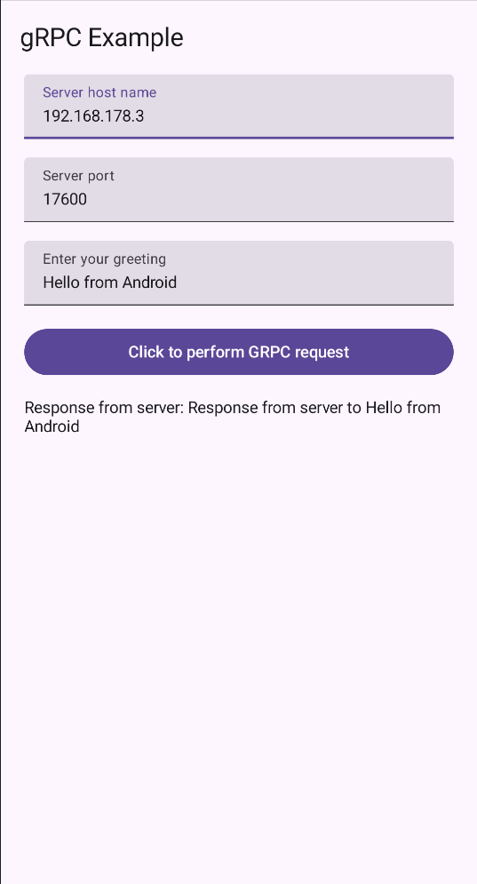
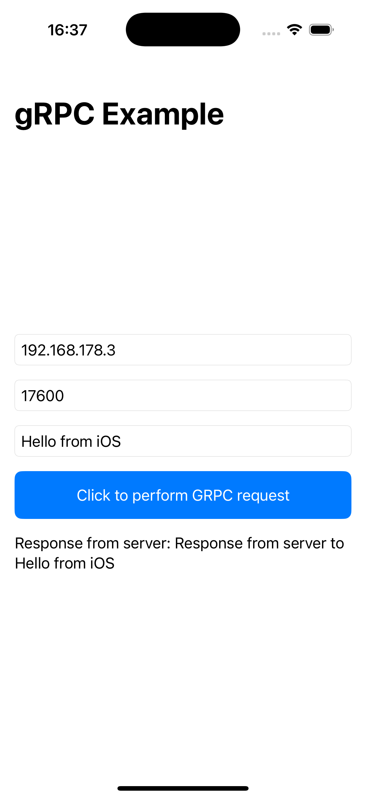

Illustrates how grpc multiplatform can work.

## 1. Run the server
Run the server located in the jvm module.

# Android example
Run the Android app in the android module.


# iOS example
Run the iOS app in the iosApp folder:
1. Open the example project in IntelliJ/Android Studio
2. Run the gradle command `gradle :commmon:build`
3. In a terminal, execute `pod install` in `/iosApp`
4. In Xcode, open `/iosApp/iosApp.xcworkspace` as a new project.
5. In Xcode, double-click on the `Pods` project and for project `iosApp` go to `Build Settings`. Search for `C++ Language Dialect` and set it to `C++17`.
6. You can now build the app.



## JVM example
Run the client in the jvm module.

## Web/JS example
1. Start the envoy server:
```
cd jvm
docker run --rm -it -v $(pwd)/envoy-custom.yaml:/envoy-custom.yaml --network=host envoyproxy/envoy-dev:8ec461e3a6ff2503a05e599029c47252d732d87b -c /envoy-custom.yaml
```
2. Run the gradle task js:browserDevelopmentRun